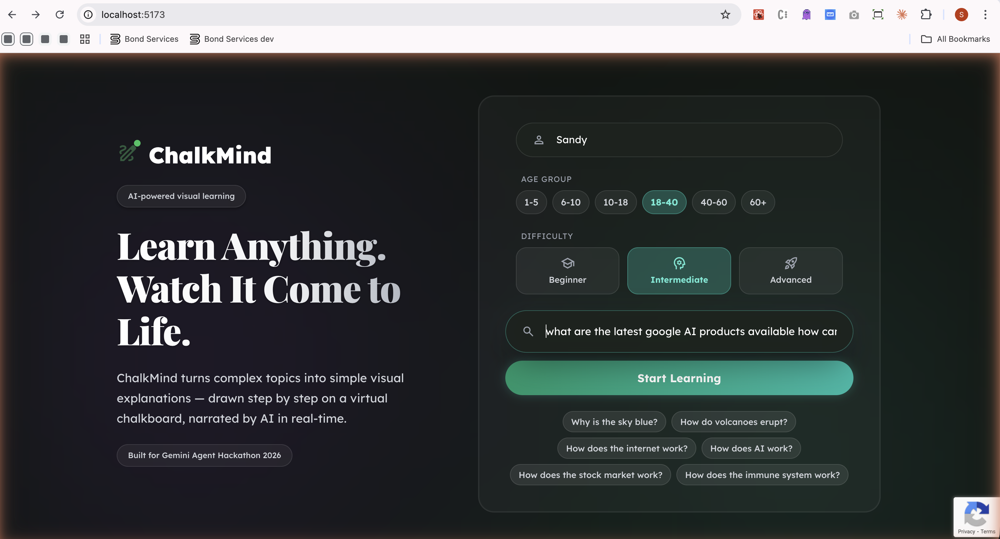
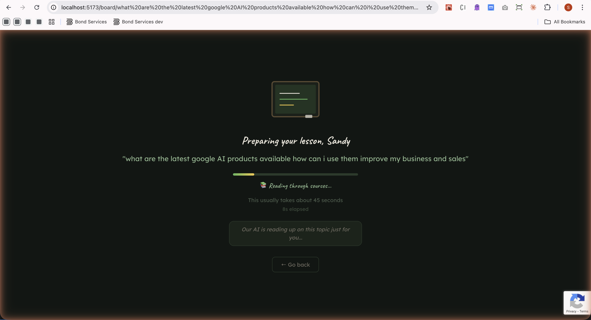
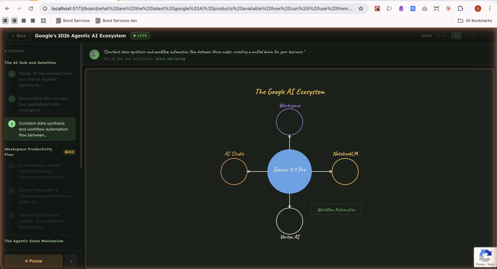
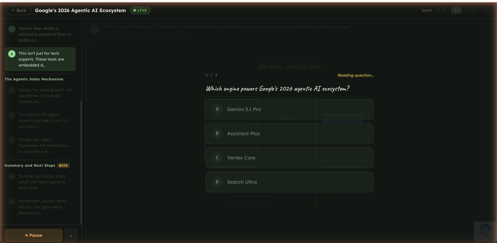
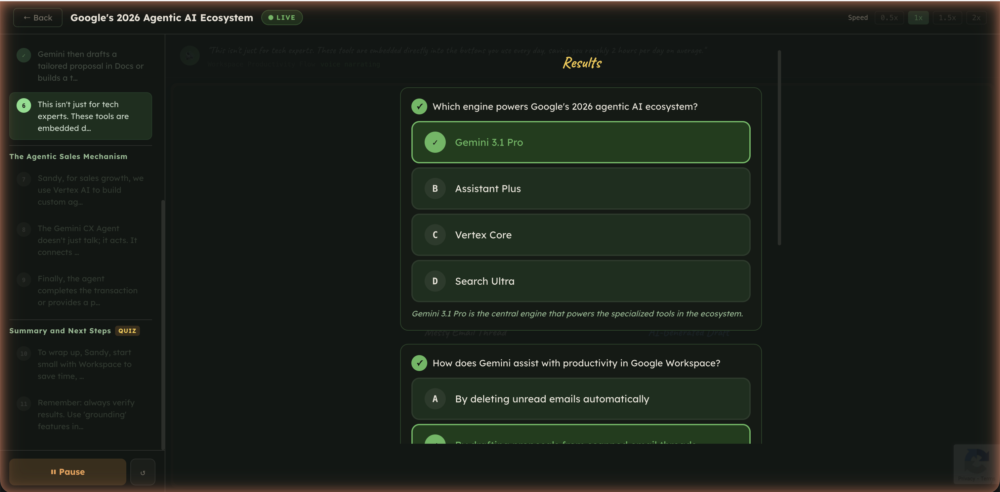
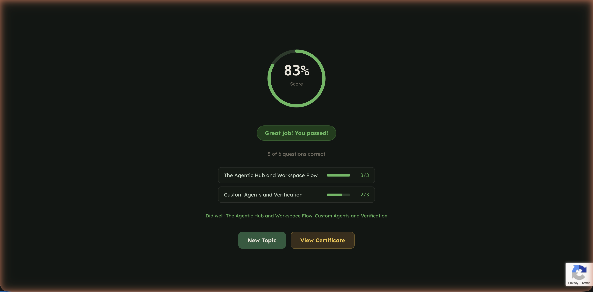
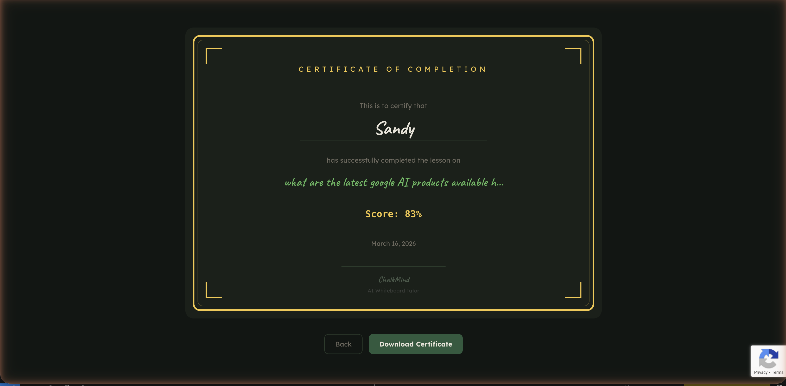

# ChalkMind — AI Whiteboard Tutor

> Learn anything. Watch it come to life.

ChalkMind is an AI-powered learning app that turns any topic into an interactive, narrated whiteboard lesson. A user types a topic, and Gemini generates a multi-scene lesson with animated SVG drawings on a virtual chalkboard — narrated in real-time with voice via a bidirectional WebSocket connection. Each lesson includes per-scene quizzes to reinforce learning.

**<a href="https://chalkmind-73859405427.us-central1.run.app/" target="_blank">Try it live</a>**

Built for the <a href="https://geminiliveagentchallenge.devpost.com/" target="_blank">Gemini Live Agent Challenge</a> hackathon (Category: **Creative Storyteller**). Powered entirely by Google Gemini models, Google ADK, and Google Cloud.

---

## Built with Google Cloud & AI

| Technology                        | Usage                                                                                                  |
| --------------------------------- | ------------------------------------------------------------------------------------------------------ |
| **Google GenAI SDK**              | Gemini API calls, structured output, content types                                                     |
| **Google ADK**                    | Agent framework — research, lesson, quiz, and voice narration agents with bidirectional live streaming |
| **Gemini 3.1 Flash Lite**         | Topic research with web grounding                                                                      |
| **Gemini 3 Flash**                | Lesson generation (structured JSON drawing DSL) + quiz generation                                      |
| **Gemini 2.5 Flash Native Audio** | Real-time voice narration via `Runner.run_live()`                                                      |
| **Google Search (web grounding)** | Real-time web research before lesson generation                                                        |
| **Google Cloud Run**              | Serverless deployment with WebSocket support                                                           |
| **Google Artifact Registry**      | Docker image storage                                                                                   |
| **Google Secret Manager**         | Runtime secrets injection                                                                              |
| **Google Cloud Build**            | CI/CD deployment                                                                                       |
| **Workload Identity Federation**  | Keyless GitHub → GCP authentication                                                                    |
| **reCAPTCHA v3**                  | Bot protection                                                                                         |

---

## Screenshots

### 1. Landing Page
Enter your name, age group, difficulty level, and a topic to learn about. Suggested topics are provided for quick start.



### 2. Loading
Gemini researches your topic (with web grounding) and generates a multi-scene lesson with drawing commands and quiz questions.



### 3. Whiteboard Lesson
The AI draws animated SVG diagrams on a chalkboard while narrating each step with real-time voice. A sidebar shows the lesson outline with scenes and steps. Playback controls allow pause, resume, restart, and speed adjustment.



### 4. Quiz
After each scene, a timed multiple-choice quiz tests your understanding of the material just covered.



### 5. Quiz Results
See which answers were correct or incorrect, with detailed explanations for each question.



### 6. Score
A per-scene breakdown shows your score with pass/fail status for each section of the lesson.



### 7. Certificate
Earn a downloadable certificate of completion after finishing the lesson.



---

## How It Works

### User Journey

1. **Enter a topic** — provide your name, age group, difficulty level, and a topic you want to learn about
2. **AI researches the topic** — a Gemini research agent uses Google Search web grounding to gather real, up-to-date facts
3. **Lesson generation** — a second agent generates a multi-scene lesson as structured JSON (drawing DSL commands + narration text); a third agent generates cumulative quiz questions at scene checkpoints
4. **Animated whiteboard** — SVG drawings animate onto a chalkboard canvas (stroke draw-on, typewriter text, fade-in effects) via Framer Motion
5. **Real-time voice narration** — an ADK narration agent streams audio via bidirectional WebSocket, narrating step-by-step with Gemini's native audio model, synced with canvas animations
6. **Interactive quizzes** — timed multiple-choice questions appear after each scene; the voice agent reads questions aloud and reveals answers with explanations
7. **Score and certificate** — per-scene score breakdown with pass/fail status and a downloadable certificate of completion

### Technical Pipeline

```
┌────────────────┐    ┌────────────────┐    ┌────────────────┐    ┌────────────────┐
│  1. RESEARCH   │    │ 2. LESSON GEN  │    │  3. QUIZ GEN   │    │   4. VOICE     │
│                │    │                │    │                │    │   NARRATION    │
│ Gemini 3.1     │───▶│ Gemini 3 Flash │───▶│ Gemini 3 Flash │───▶│ Gemini 2.5     │
│ Flash Lite     │    │                │    │                │    │ Flash Native   │
│                │    │ Structured     │    │ Multiple-      │    │ Audio          │
│ + Google       │    │ JSON: scenes,  │    │ choice Qs      │    │                │
│   Search       │    │ steps, drawing │    │ per scene      │    │ ADK Runner     │
│   (grounding)  │    │ DSL, narration │    │                │    │ .run_live()    │
│                │    │                │    │                │    │ bidi WebSocket │
└────────────────┘    └────────────────┘    └────────────────┘    └────────────────┘
      HTTP                  HTTP                  HTTP             WebSocket (live)
```

---

## Architecture

```
┌─────────────────────────────────────────────────────────────────────────┐
│                            USER (Browser)                               │
│                                                                         │
│   React + Vite + TypeScript Frontend                                    │
│   ┌───────────-──────┐  ┌────────────────────┐  ┌────────────────────┐  │
│   │ Landing Page     │  │ Chalkboard Canvas  │  │ Audio Worklets     │  │
│   │ (topic form)     │  │ (Framer Motion     │  │ ┌────────────────┐ │  │
│   │                  │  │  SVG animation)    │  │ │ Capture 16kHz  │ │  │
│   │                  │  │                    │  │ │ Playback 24kHz │ │  │
│   └────────────-─────┘  └────────────────────┘  │ └────────────────┘ │  │
│                                                 └────────────────────┘  │
└──────────┬────────────────────────┬─────────────────────────────────────┘
           │ POST /api/             │ WS /ws/voice/{id}
           │ generate-lesson        │ (binary PCM audio
           │ (JSON)                 │  + JSON control msgs)
           ▼                        ▼
┌─────────────────────────────────────────────────────────────────────────┐
│                      FastAPI Backend (Cloud Run)                        │
│                                                                         │
│   ┌────────────────────────┐    ┌────────────────────────────────────┐  │
│   │ Lesson Generator       │    │ Voice Session (ADK Live API)       │  │
│   │                        │    │                                    │  │
│   │  Step 1: Research      │    │  LiveRequestQueue                  │  │
│   │  (web grounding)       │    │       │                            │  │
│   │         │              │    │       ▼                            │  │
│   │  Step 2: Generate      │    │  Runner ──► Narration Agent        │  │
│   │  (structured JSON)     │    │              │                     │  │
│   │         │              │    │  Voice Session State Machine       │  │
│   │  Step 3: Quiz Gen      │    │  (step tracking, quiz flow)        │  │
│   └────────────┬───────────┘    └────────────────┬───────────────────┘  │
│                │                                 │                      │
│   Security: reCAPTCHA, profanity filter,         │                      │
│   rate limiting, input sanitization              │                      │
└────────────────┼─────────────────────────────────┼──────────────────────┘
                 │                                 │
                 ▼                                 ▼
┌─────────────────────────────────────────────────────────────────────────┐
│                        Google Gemini APIs                               │
│                                                                         │
│   ┌───────────────────────┐  ┌───────────────────────────────────────┐  │
│   │ gemini-3.1-flash-     │  │ gemini-2.5-flash-native-audio-        │  │
│   │ lite-preview          │  │ preview (native audio model)          │  │
│   │ (research + search)   │  │                                       │  │
│   ├───────────────────────┤  │ Real-time voice narration via         │  │
│   │ gemini-3-flash-       │  │ ADK bidirectional streaming           │  │
│   │ preview               │  │ Voice: Kore                           │  │
│   │ (lesson + quiz gen)   │  │ Session limit: 15 min                 │  │
│   └───────────────────────┘  └───────────────────────────────────────┘  │
└─────────────────────────────────────────────────────────────────────────┘
```

**Key architectural decisions:**
- **No database** — the app is stateless. Lessons are generated on-demand and streamed to the client. Session state lives in-memory for the duration of a voice session.
- **Single WebSocket** carries both binary PCM audio frames and JSON text control messages (step advances, quiz events, transcripts).
- **Pre-generated lessons** — all scenes, steps, and drawing commands are generated before voice narration begins, ensuring reliable sync between visuals and audio.
- **AudioContext suspend/resume** for pause/resume — pauses audio output without destroying the WebSocket, so Gemini keeps streaming to a ring buffer and playback resumes seamlessly.
- **Four ADK agents** — topic researcher, lesson generator, quiz generator, voice narrator — each with specialized system instructions and model configurations.
- **Custom Drawing DSL** (9 primitive types: path, line, arrow, circle, ellipse, rect, text, annotation, brace) — Gemini outputs structured JSON commands, not raw SVG, ensuring reliable rendering and animation.

---

## Models

| Model                                   | Purpose           | Details                                                                                                          |
| --------------------------------------- | ----------------- | ---------------------------------------------------------------------------------------------------------------- |
| `gemini-3.1-flash-lite-preview`         | Topic research    | Web grounding via `google_search` tool. Gathers current information about the requested topic.                   |
| `gemini-3-flash-preview`                | Lesson generation | Generates multi-scene lesson with structured JSON output (drawing DSL commands, narration text, quiz questions). |
| `gemini-3-flash-preview`                | Quiz generation   | Creates cumulative multiple-choice quiz questions at checkpoint scenes.                                          |
| `gemini-2.5-flash-native-audio-preview` | Voice narration   | Native audio model for real-time voice narration via ADK bidirectional streaming. Voice: Kore.                   |

The lesson generation uses a **two-step pipeline** because Gemini's web grounding (`google_search`) cannot be combined with `response_schema` in the same API call:
1. **Research call** — grounded web search to gather topic information
2. **Generation call** — structured JSON output with drawing commands and lesson content

---

## Prerequisites

- **Node.js** 20+ and **npm**
- **Python** 3.10+ and **pip**
- **Google API Key** with access to Gemini models ([Get one here](https://aistudio.google.com/apikey))
- **Docker** (optional, for containerized deployment)
- **Google Cloud SDK** (optional, for GCP deployment)

---

## Setup

### 1. Clone the repository

```bash
git clone <repo-url>
cd app
```

### 2. Create a Python virtual environment

```bash
python3 -m venv ../.venv
source ../.venv/bin/activate
```

### 3. Configure environment variables

```bash
cp .env.example .env
```

Edit `.env` and add your Google API Key:

```
GOOGLE_API_KEY=your-google-api-key-here
```

All other variables are optional for local development. See [ENV.md](ENV.md) for full documentation.

### 4. Install dependencies

```bash
make install
```

This runs `npm install` (frontend) and `pip install -e .` (backend).

### 5. Start the development server

```bash
make dev
```

This starts both servers concurrently:
- **Frontend:** Vite dev server on `http://localhost:5173`
- **Backend:** Uvicorn with hot-reload on `http://localhost:8000`

The frontend proxies `/api` and `/ws` requests to the backend automatically.

---

## How to Test the App

### Quick test (landing page only)

1. Run `make dev`
2. Open `http://localhost:5173` in Chrome
3. Enter your name, select an age group and difficulty level
4. Type a topic (e.g., "How do volcanoes erupt?") or click a suggested topic
5. Click **Start Learning**

### Full lesson + voice test

1. Run `make dev` and open `http://localhost:5173`
2. Submit a topic — the lesson generation takes ~10-20 seconds
3. Once loaded, the whiteboard appears with a lesson outline sidebar
4. Voice narration auto-starts — the AI draws and narrates each step
5. Use playback controls:
   - **Pause** — suspends audio and animation (voice session stays alive)
   - **Resume** — picks up exactly where it left off
   - **Restart** (↺) — stops and restarts the entire lesson from scratch
   - **Speed** — 0.5x, 1x, 1.5x, 2x playback speed
6. After each scene, a **quiz** appears with timed multiple-choice questions
7. At the end, a score summary and certificate are shown

### Silent playback (no microphone)

If the browser blocks microphone access or the WebSocket fails to connect, the app falls back to silent timer-based playback — drawing animations still play, but without voice narration.

### API health check

```bash
curl http://localhost:8000/api/health
```

### Type checking

```bash
cd frontend && npx tsc --noEmit
```

---

## Tech Stack

### Backend
| Package          | Version   | Purpose                                   |
| ---------------- | --------- | ----------------------------------------- |
| FastAPI          | >=0.115.0 | HTTP + WebSocket server                   |
| Uvicorn          | >=0.34.0  | ASGI server                               |
| Google ADK       | >=1.2.0   | Agent framework, Runner, LiveRequestQueue |
| Google GenAI     | >=1.0.0   | Gemini SDK, types, structured output      |
| Pydantic         | >=2.0.0   | Data validation, request/response schemas |
| SlowAPI          | >=0.1.9   | Rate limiting                             |
| better-profanity | >=0.7.0   | Input content filtering                   |
| Langfuse         | >=3.0.0   | AI agent tracing & observability          |

### Frontend
| Package           | Version | Purpose                            |
| ----------------- | ------- | ---------------------------------- |
| React             | 19.x    | UI framework                       |
| Vite              | 7.x     | Build tool & dev server            |
| TypeScript        | 5.x     | Type safety                        |
| Framer Motion     | 12.x    | SVG draw-on animation, transitions |
| MUI (Material-UI) | 7.x     | UI components, theming             |
| React Router      | 7.x     | Client-side routing                |
| Sass              | 1.x     | Styling                            |

### Audio Pipeline
- **Capture:** `AudioContext({ sampleRate: 16000 })` + AudioWorklet → Int16 PCM
- **Playback:** `AudioContext({ sampleRate: 24000 })` + ring buffer AudioWorklet
- No manual resampling — browser handles via AudioContext sampleRate
- Echo cancellation enabled via `getUserMedia` constraints

---

## CI/CD

### GitHub Actions (`.github/workflows/deploy.yml`)

Automated deployment pipeline triggered on push to `main` or manual dispatch:

```
Push to main
    │
    ▼
┌─────────────────────────────────┐
│ 1. Checkout code                │
│ 2. Authenticate to GCP          │
│    (Workload Identity           │
│     Federation — no keys)       │
│ 3. Login to Artifact Registry   │
│ 4. Build Docker image           │
│    (multi-stage: Node → Python) │
│ 5. Push to Artifact Registry    │
│ 6. Deploy to Cloud Run          │
└─────────────────────────────────┘
```

**Authentication:** Uses [Workload Identity Federation (WIF)](https://cloud.google.com/iam/docs/workload-identity-federation) — no service account keys stored in GitHub. The GitHub OIDC token is exchanged for GCP credentials at deploy time.

**Required GitHub Secrets:**
| Secret                | Description                              |
| --------------------- | ---------------------------------------- |
| `WIF_PROVIDER`        | Workload Identity Provider resource name |
| `WIF_SERVICE_ACCOUNT` | GCP service account email                |
| `GCP_PROJECT_ID`      | Google Cloud project ID                  |

**Required GitHub Variables:**
| Variable                  | Description                          |
| ------------------------- | ------------------------------------ |
| `VITE_GA_MEASUREMENT_ID`  | Google Analytics 4 measurement ID    |
| `VITE_RECAPTCHA_SITE_KEY` | reCAPTCHA v2 site key                |
| `VITE_QUIZ_TIMER_SECONDS` | Quiz timer duration                  |
| `RECAPTCHA_ENABLED`       | Enable reCAPTCHA (`true`/`false`)    |
| `LANGFUSE_BASE_URL`       | Langfuse tracing endpoint            |
| `RATE_LIMIT`              | API rate limit (e.g., `1/30seconds`) |
| `QUIZ_TIMER_SECONDS`      | Backend quiz timer                   |

### Cloud Build (`cloudbuild.yaml`)

Alternative deployment via `gcloud builds submit`:

```bash
make deploy
```

### Docker

Multi-stage Dockerfile:
1. **Stage 1 (Node 20):** Builds React frontend with Vite, bakes `VITE_*` env vars
2. **Stage 2 (Python 3.10):** Installs Python dependencies, copies backend + built frontend

```bash
make docker-build      # Build locally
```

### Cloud Run Configuration

| Setting          | Value                                   |
| ---------------- | --------------------------------------- |
| Region           | `us-central1`                           |
| Service          | `chalkmind`                             |
| Memory           | 1Gi                                     |
| Timeout          | 3600s (1 hour for long voice sessions)  |
| Min instances    | 0 (scale to zero)                       |
| Max instances    | 3                                       |
| Session affinity | Enabled (sticky sessions for WebSocket) |
| Authentication   | Allow unauthenticated                   |

Secrets are stored in **Google Secret Manager** and injected at runtime:
- `GOOGLE_API_KEY`
- `RECAPTCHA_SECRET_KEY`
- `LANGFUSE_SECRET_KEY`
- `LANGFUSE_PUBLIC_KEY`

---

## Project Structure

```
app/
├── backend/
│   ├── main.py                 # FastAPI app, endpoints, WebSocket handler
│   ├── lesson_generator.py     # Two-step Gemini pipeline (research → generation)
│   ├── voice_agent.py          # ADK narration agent factory
│   ├── voice_session.py        # Voice session state machine
│   ├── config.py               # Configuration
│   ├── observability.py        # Langfuse tracing
│   ├── middleware/              # CORS, rate limiting
│   ├── models/                 # Pydantic request schemas
│   └── security/               # reCAPTCHA, profanity filter, sanitizer
├── frontend/
│   ├── src/
│   │   ├── pages/
│   │   │   ├── LandingPage.tsx     # Topic form with age/difficulty selectors
│   │   │   └── BoardPage.tsx       # Canvas + voice + quiz orchestration
│   │   ├── components/
│   │   │   ├── board/
│   │   │   │   ├── ChalkboardCanvas.tsx  # SVG renderer (Framer Motion)
│   │   │   │   └── DrawCommand.tsx       # DSL → SVG element mapping
│   │   │   ├── quiz/QuizOverlay.tsx      # Quiz UI with timer
│   │   │   └── score/                    # Certificate, score display
│   │   ├── hooks/
│   │   │   ├── useLesson.ts        # Lesson fetch hook
│   │   │   ├── usePlayback.ts      # Timer-based step animation
│   │   │   ├── useVoiceSession.ts  # WebSocket + AudioWorklet
│   │   │   └── useQuiz.ts          # Quiz state machine
│   │   ├── types/lesson.ts         # TypeScript types
│   │   └── theme.ts                # MUI theme (chalkboard palette)
│   ├── public/
│   │   ├── audio-capture.js        # Mic capture AudioWorklet (16kHz)
│   │   └── audio-playback.js       # Speaker playback AudioWorklet (24kHz)
│   └── vite.config.ts              # Dev proxy to backend
├── .env.example                    # Environment variable template
├── Dockerfile                      # Multi-stage build (Node → Python)
├── cloudbuild.yaml                 # GCP Cloud Build config
├── Makefile                        # Dev commands
├── pyproject.toml                  # Python dependencies
└── .github/workflows/deploy.yml    # GitHub Actions CI/CD
```

---

## Make Commands

| Command             | Description                              |
| ------------------- | ---------------------------------------- |
| `make install`      | Install all dependencies (npm + pip)     |
| `make dev`          | Run frontend + backend concurrently      |
| `make dev-frontend` | Vite dev server only (port 5173)         |
| `make dev-backend`  | Uvicorn with hot-reload only (port 8000) |
| `make build`        | Production frontend build                |
| `make docker-build` | Build Docker image locally               |
| `make deploy`       | Deploy via Cloud Build                   |
| `make clean`        | Remove build artifacts                   |

---

## License

Built for the Gemini Live Agent Challenge 2026. Powered by Google Gemini and Google Cloud.
